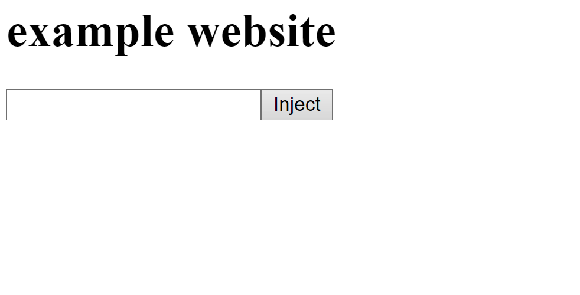

# Inject JS - A easy way to inject code.
**Drag to bookmark bar to use.**

# Features


```javascript
javascript:/*javInject*/function Ox9512(){alert("Made by @Ben3Coder")};function Ox5821(args){Function(args)();};function Ox9612(args){Ox5821(args)};;function Ox9542(){document.body.innerHTML=document.body.innerHTML+"<input id='2uMan4Lm' type='text'><button type='submit' onclick='Ox9612(document.getElementById("+'"2uMan4Lm"'+").value)'>Inject</button></input>"};Ox9512();Ox9542()
```
version 1.0.0 by [@Ben3Coder](https://replit.com/@Ben3Coder) on replit
