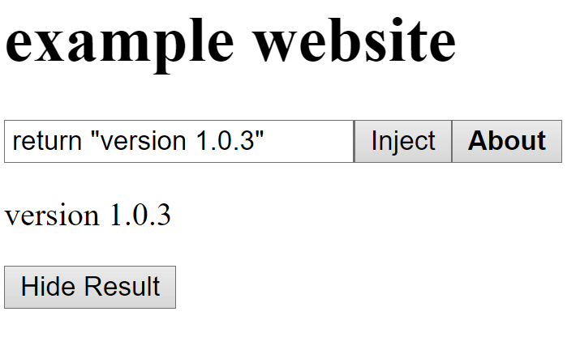

**⚠⚠ THIS IS FOR EDUCATIONAL PURPOSES ONLY ⚠⚠**
# Inject JS - A easy way to inject code.

# Features

This was a simple injection


**Drag to bookmark bar to use.**
**known issue: will always show at bottom of website.**
```javascript
javascript:/*javInject*/function Ox9512(){alert("Made by @Ben3Coder v1.0.3")};function Ox5821(args){e = Function(args)();document.body.innerHTML = document.body.innerHTML+"<p id='result_La3fna'>"+e+"</p><button onclick='document.getElementById("+'"result_La3fna"'+").outerHTML="+'""'+";this.outerHTML="+'""'+"'>Hide Result</button>" };function Ox9612(args){Ox5821(args)};;function Ox9542(){document.body.innerHTML=document.body.innerHTML+"<input id='2uMan4Lm' type='text'><button type='submit' onclick='Ox9612(document.getElementById("+'"2uMan4Lm"'+").value)'>Inject</button><button onclick='alert("+'"Inject-JS 1.0.3 by @Ben3Coder https://github.com/benjitran2009/inject-js/blob/main/README.md"'+")'><b>About</b></button></input>"};Ox9512();Ox9542()
```
version 1.0.3 by [@Ben3Coder](https://replit.com/@Ben3Coder) on replit
